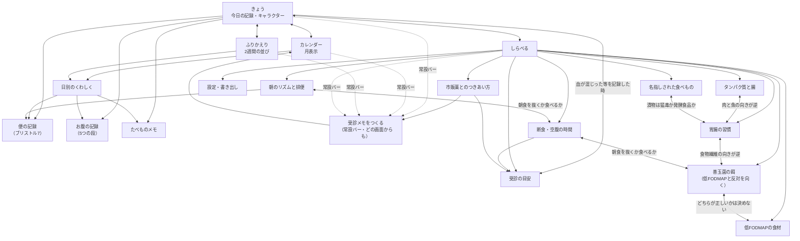

# 画面遷移とワイヤーフレーム（第1弾）

`MVP.md` で第1弾と決めた範囲だけの画面。**画面は12**、下部ナビは5つ
（`きょう／カレンダー／ふりかえり／しらべる／目次`）。

---

## 1. 画面遷移図



**下部ナビは5つ**：`きょう／カレンダー／ふりかえり／しらべる／目次`。
そのすぐ上に**常設バー「受診メモをつくる」**を置く（鍼灸アプリの合格ロードマップバーと同じ形）。
受診メモはこのアプリを持つ理由なので、思い立った時にどの画面からでも開けること。

**入口は3つだけ**にする（便・お腹・たべもの）。記録の入口が増えるほど、朝の1タップが遠くなります。

---

## 2. ワイヤーフレーム

モノクロ（黒地に白／白地に黒のどちらか一方に決める。企画では**白地に黒**を既定とし、
夜間の記録が多い想定で夜モードを別に持つ）。幅はスマホ1枚（横スクロールを作らない）。

### 2-1. きょう（ホーム）

```
┌────────────────────────────┐
│  腸                      │
├────────────────────────────┤
│                            │
│         ( ◠ ‿ ◠ )          │  ← 腸のキャラクター（SVG）
│      ～～～～～～～～        │     記録すると表情が変わる
│                            │     ※ 責める顔・泣く顔は持たない
│   きょうはどうですか？        │
│                            │
├────────────────────────────┤
│  お腹の調子                 │
│  ┌───┬───┬───┬───┬───┐   │  ← 5つの段。数字は出さない
│  │とて│ 楽 │ふつ│つら│とて│   │
│  │も楽│    │ う │ い │もつ│   │
│  └───┴───┴───┴───┴───┘   │
├────────────────────────────┤
│  お通じ            ＋ ふやす │
│  ┌──┬──┬──┬──┬──┬──┬──┐│  ← ブリストル1〜7（絵で選ぶ）
│  │ 1│ 2│ 3│ 4│ 5│ 6│ 7││     絵の下に短い言葉
│  └──┴──┴──┴──┴──┴──┴──┘│     （コロコロ／かたい／…／水）
│  きょう 2回                 │
│  □ 急に間に合わない感じ      │
│  □ 血が混じった             │  ← チェックすると
├────────────────────────────┤     「受診の目安」への行き先を出す
│  痛み  ○なし ○すこし ○ある  │     （判定はしない・色を変えない）
│  張り  ○なし ○すこし ○ある  │
├────────────────────────────┤
│  たべたもの            ＋   │
│  ・朝 ヨーグルト、パン       │
│  ・昼 —                    │
│  よく食べるもの: [ヨーグルト] │  ← 一度書いたものはタップで再入力
│                [うどん] …  │
├────────────────────────────┤
│  ひとこと（任意）          │
├────────────────────────────┤
│  記録した日 38日            │  ← 連続日数は出さない
│  この2週間 ▓▓░▓▓▓░▓▓▓▓░▓▓ │
├────────────────────────────┤
│   受診メモをつくる        │  ← 常設バー
├────────────────────────────┤
│  きょう  カレンダー  ふりかえり  しらべる │
└────────────────────────────┘
```

**朝ひとタップの意味**：お腹の段を1つ押した時点で、その日は「記録した日」になります。
残りは空でよい（空欄を赤くしない・催促しない）。

### 2-2. カレンダー

```
┌────────────────────────────┐
│  ‹  2026年9月  ›            │
├────────────────────────────┤
│  日 月 火 水 木 金 土        │
│      1  2  3  4  5  6       │
│     ▓  ▒  ░  ·  ▓  ▒       │  ← 濃さ＝お腹の段（5段）
│   7  8  9 10 11 12 13       │     記録が無い日は「·」
│   ·  ▓  ▓  ▒  ░  ·  ·      │     ※ 色を使わない
│  …                         │
├────────────────────────────┤
│  凡例 ▓つらい ▒ふつう ░楽    │
│       · 記録なし            │
├────────────────────────────┤
│  9月2日（水）               │
│  お腹：つらい                │
│  お通じ：ブリストル6 × 2回   │
│  たべたもの：ヨーグルト、パン │
│  ひとこと：会議の前から痛い   │
│  ［この日を書きかえる］       │
└────────────────────────────┘
```

### 2-3. ふりかえり（2週間の並び）

```
┌────────────────────────────┐
│  ふりかえり                 │
│  ［2週間］［1か月］［3か月］ │
├────────────────────────────┤
│  お腹の段                   │
│  つらい ┤    ●   ●●        │  ← 素のSVG。ライブラリを入れない
│  ふつう ┤ ●●  ●     ● ●    │
│    楽  ┤●        ●    ●●  │
│        └─────────────────  │
│         8/20        9/2     │
├────────────────────────────┤
│  お通じ（ブリストル）        │
│   7 ┤   ▪  ▪▪               │
│   4 ┤▪▪  ▪   ▪  ▪▪         │
│   1 ┤      ▪                │
├────────────────────────────┤
│  よく食べていたもの（14日）  │
│  ヨーグルト 9日 / パン 8日   │
│  たまねぎ 5日 / りんご 4日   │
│                            │
│  ※ 食べたものとお腹の調子を  │
│    並べています。どちらかが   │
│    どちらかの原因かは、この   │
│    表からは分かりません。     │
│    気になるものは、しばらく   │
│    やめてみて記録を続けると   │
│    自分の答えが出ます。       │
├────────────────────────────┤
│  この期間の記録日 11 / 14日  │
└────────────────────────────┘
```

**ここが第1弾でいちばん壊しやすいところ。** 「たまねぎ → 腹痛」と矢印で結んだ瞬間に、
このアプリは根拠のない食事指導になります。並べるだけにして、結ぶのは本人に任せる。

### 2-4. 受診メモをつくる

```
┌────────────────────────────┐
│  受診メモをつくる         │
├────────────────────────────┤
│  期間 ［直近2週間 ▾］        │
│  入れるもの                 │
│   お通じ（回数・かたさ）    │
│   お腹の調子              │
│   気になる項目（血・急ぎ）  │
│   たべたもの              │
│   ひとこと                │
├────────────────────────────┤
│  できあがり（そのまま読める） │
│  ┌──────────────────────┐ │
│  │ 2026/8/20〜9/2（14日） │ │
│  │ 記録した日：11日        │ │
│  │ 排便：計21回（1日0〜3回）│ │
│  │  かたさ 6〜7：13回      │ │
│  │  かたさ 3〜5：6回       │ │
│  │  かたさ 1〜2：2回       │ │
│  │ 間に合わない感じ：5日   │ │
│  │ 血が混じった：0日       │ │
│  │ お腹がつらい：4日       │ │
│  │ 本人メモ：会議のある日に │ │
│  │  痛みが出ることが多い    │ │
│  └──────────────────────┘ │
│  ［コピー］［ファイルに書き出す］│
├────────────────────────────┤
│  ※ これは診断ではありません。 │
│    見せる相手は本人が選びます。│
└────────────────────────────┘
```

**文章は事実を並べた順に組み立てるだけ**（「IBSの疑い」等の解釈を書かない。鏡の
`toConsultText` と同じ線）。数え方は本人の記録だけから出す。

### 2-5. 受診の目安（レッドフラグ）

```
┌────────────────────────────┐
│  受診の目安               │
├────────────────────────────┤
│  次のことがあるときは、       │
│  お腹の不調が続いているか     │
│  どうかに関わらず、           │
│  医療機関で相談してください。 │
│                            │
│  ・便に血が混じる            │
│  ・黒いタール状の便          │
│  ・体重が思いあたる理由なく減る│
│  ・夜中に目が覚めるほどの痛み │
│  ・熱が続く                 │
│  ・貧血を指摘された          │
│  ・50歳を過ぎてはじめて出た  │
│    お腹の症状                │
│  ・家族に大腸の病気の人がいる │
│                            │
│  当てはまる数は数えません。   │
│  当てはまらなくても、つらい   │
│  ときは受診してよいです。     │
│                            │
│  出典：（書名・発表者・年）   │
│  最終確認：2026-09-02        │
└────────────────────────────┘
```

**色を変えない・数えない・「緊急度」と書かない。** 一覧を読むだけの画面にします。

### 2-6. 低FODMAPの食材

```
┌────────────────────────────┐
│  低FODMAPの食材           │
│  ［さがす            ］    │
│  ［少なめ］［多め］［どちらも］│
├────────────────────────────┤
│  ごはん・パン・めん          │
│   ・白米          少なめ     │
│   ・小麦のパン    多め       │
│   ・そば（十割）  少なめ     │
│  やさい                     │
│   ・にんじん      少なめ     │
│   ・たまねぎ      多め       │
│  …                         │
├────────────────────────────┤
│  ※ 量によって変わります。     │
│    少なめの食材でも、たくさん │
│    食べれば合わないことが     │
│    あります。                │
│  ※ 一覧は改訂され続けています。│
│    出典：（発表者・年）       │
│    最終確認：2026-09-02      │
│  ※ 低FODMAPは自己流で長く    │
│    続ける食事ではありません。 │
│    続けるときは管理栄養士・   │
│    医師に相談してください。   │
└────────────────────────────┘
```

一覧に**自分のからだの結果**（合った／合わなかった）を1件ずつ付けられるようにします
（これが低FODMAPの本来の使い方＝一度減らして一つずつ戻す、に沿うため）。
ただし**合う／合わないを機械が判定しない**。押すのは本人。

---

## 3. データの持ち方（実装したもの）

日付キー1本にそろえています（機能ごとに別のストアを作らない）。
保存は `localStorage` の `chou:v1` ひとつだけ（`src/lib/storage.js`）。

```js
// state.days の1件（key = date）
{
  date: '2026-09-02',       // YYYY-MM-DD（ローカル日付。toISOString() を使わない）
  belly: 'hard',            // BELLY_STEPS の id（数値にしない）
  pain: 'some',             // LEVELS の id（none / slight / some / strong）
  bloat: 'slight',
  stools: [                 // 回数ぶん
    { id: 's…', at: '07:20', bristol: 6, marks: ['urgent'] }
  ],
  meals: [
    { id: 'm…', at: '08:10', text: 'ヨーグルト、パン' }
  ],
  note: '会議の前から痛い',
  updatedAt: 1756…
}
```

守っていること：

1. **保存するのは入力だけ。** 集計・判定の結果を保存しない（あとでロジックを直しても
   過去の記録を読み直せる。腰痛ナビのカルテ・鏡の見立てと同じ）。
2. **`belly` を数値で持たない。** 並べ替えが要る所では `BELLY_STEPS` の `order` を使う。
   数値で持つと、いつか平均を出したくなり、平均を出すと点数になります。
3. **`bristol` は 1〜7 の整数**（医療で通じる共通の物差しなので、受診メモにもこの数字で書く）。
   **平均を出さない**——1と7が1回ずつあった日の平均4は「ふつうの便が1回あった」ではありません。
   出すのは分布（`stats.bristolCounts`）と回数の幅（`stoolPerDay`）だけ。
4. **日付は文字列で組み立てる。** `new Date('YYYY-MM-DD')` も `toISOString()` も使わない
   （`src/lib/dates.js` が単一の正。テストが機械チェックする）。
5. **外から来たものは必ず `normalizeDay` を通す**（取り込みも端末内のものも）。
   項目が1つ欠けているだけで画面が落ちるのを防ぐため。
6. **消したものは20秒だけ戻せる**（`useStore` の `undo`）。戻す用の控えは端末に保存しない。
7. **「なし」を選んだだけでは「記録した日」にしない**（押していないのと区別が付かないため。
   `hasRecord` が単一の正）。

### 保存を IndexedDB にしなかった理由

企画の時点では IndexedDB と書いていましたが、実装では `localStorage` にしました。
第1弾に写真を入れないので容量が要らず、同梱の他アプリ（鏡・間合い）と同じ形になるためです。
写真を足すときは、日別の記録とは**別のストア**へ入れること（日別が重くなると、
書き出し・読み込みが一気に遅くなる）。

---

## 4. 実装（作ったもの）

- **Vite + React（JSX・TypeScript なし・外部ランタイム依存なし）**、保存は `localStorage`。
- 公開パスは `/chou`。`.github/workflows/deploy.yml` に追加済み（npm ci → npm test → npm run build）。
- `src/lib/` は**ネットワークに触れない**（`test/offline.test.mjs` が機械チェック）。
- **画像ファイルを持たない。** キャラクター（`components/Gut.jsx`）・ブリストルの絵
  （`components/Bristol.jsx`）・下部ナビの印は、すべてその場に SVG を描く。
- **絵文字を使わない**（環境によって色付きで描かれ、モノクロの見た目が崩れる）。
- **後読み（lookbehind）を使わない**（古い Safari で読み込みごと落ちる）。

### ファイルの置き場

| ファイル | 役割 |
|---|---|
| `src/data/scales.js` | お腹の5段・4段・ブリストル7段・お通じの印。**物差しの単一の正** |
| `src/data/redFlags.js` | 受診の目安と出典 |
| `src/data/fodmap.js` | 低FODMAP の食材108件・注意書き・出典 |
| `src/lib/dates.js` | 日付（YYYY-MM-DD 文字列）。**UTCへずらさない** |
| `src/lib/storage.js` | 端末内保存だけ。**ネットワークに触れない** |
| `src/lib/days.js` | 1日の記録の作成・正規化・「記録した日」の定義 |
| `src/lib/stats.js` | 分布・回数・埋まり具合。**平均を返す関数を持たない** |
| `src/lib/visitNote.js` | 受診メモの本文の組み立て |
| `src/lib/gutLine.js` | キャラクターの一言（**テストから実際の文字列を読むために JSX から切り出してある**） |
| `src/components/DayEditor.jsx` | 1日ぶんの入力。**ホームとカレンダーの両方でこれを使う** |
| `src/lib/yomi.js` | 読み・五十音の行・数字の読み・英数字の正規化。**React に依存しない** |
| `src/lib/focus.js` | 飛び先へ運んで光らせる（`data-flash`）。**先頭へ戻すかの判定もここ** |
| `src/data/terms.js` | 用語・画面の本体データ（読み・説明・別名・飛び先を手で書く） |
| `src/data/toc.js` | `buildTocEntries()`。**目次は元データから毎回導く** |
| `src/data/tocCandidates.js` | 候補の置き場と、候補を作ってよい**3つの合図** |
| `src/data/adamski.js` | 食べ合わせ（速い／遅い／ニュートラル）・よくない組み合わせ・**裏が取れていない主張**・はじめる前の確認・出典 |
| `src/lib/combine.js` | 速さの引き当て（**出どころを必ず返す**）・組み合わせ・食事の間隔・朝の軽さ。**判定しない・保存しない** |
| `src/lib/conflicts.js` | 食い違いを**元データから毎回導く**（アダムスキー式・発酵食品・善玉菌の餌・食物繊維・肉と魚・朝食・乳製品・**漬物**・**空腹中でも食べてよいもの**の9層）。どちらが正しいかは決めない。**漬物だけは「ひとつの出典の中の食い違い」** |
| `src/data/probiotics.js` | 菌10種・出典が挙げる整腸剤7つ・**出典の誤りを正す2件**・裏が取れていない主張8件・はじめる前の確認 |
| `src/data/seasonings.js` | さしすせそ＋みりん・甘酒の7つ。**「表示のどこを見るか」を必ず持つ** |
| `src/lib/probiotic.js` | 試している期間（通算の日数。**連続日数を数えない**）。効いたかは判定しない |
| `src/data/cleanup.js` | 腸のお掃除5つ・発酵食品・ストレス解消4つ・姿勢・**出典の誤り4件の訂正**・裏が取れていない主張6件 |
| `src/data/prebiotics.js` | 善玉菌の餌14件（種類3つ）・**出典どうしの食い違い4件**・出典の誤り4件の訂正・裏が取れていない主張7件・オメガ3・リンゴ酢 |
| `src/data/butyrate.js` | 酪酸菌のはたらき5件・短鎖脂肪酸2件・**出典自身が取り下げた説**（痩せ菌・デブ菌）・訂正4件・裏が取れていない主張5件 |
| `src/data/otcDrugs.js` | お腹に関わる市販薬5種類・**言い方の訂正4件**（猛毒／99%／ヤブ医者／売上）・裏が取れていない主張3件。**飲み合わせも用量も判定しない** |
| `src/data/gutHabits.js` | 傷つけるとされる習慣7件・整えるとされる習慣4件・胃が弱っているとき避けるもの・**訂正4件**（血液型・倍率・国でひとくくり・整腸剤）・裏が取れていない主張6件 |
| `src/data/protein.js` | タンパク質源5件・出典の目安3件・**ためしにやめてみる2件**（小麦・乳製品）・ビタミンD・訂正5件（正しい割合・遅延型アレルギー検査・すべての病気・腸漏れ・内視鏡）・裏が取れていない主張9件 |
| `src/data/fasting.js` | 半日断食のやり方3件・仕組み3件・**やめどき6件**・**訂正6件**（がん・宿便・血液が汚れる・酸とアルカリ・原爆と味噌汁・背骨と内臓）・裏が取れていない主張7件 |
| `src/data/magnesium.js` | 出典が挙げる効果7件（**腸の話は1件だけ**）・食べもの4件・訂正3件・裏が取れていない主張4件。市販薬の画面の中の節 |
| `src/lib/elimination.js` | ためしにやめてみた期間。**同時に2つやめない**・守れた日数を数えない・期間が来たら「もとに戻す」を出す |
| `src/data/morning.js` | 朝に出る人の特徴4件・やってみること4件（**「出なくても責めない」を先に出す**）・訂正3件（朝一番がいちばん・出ない＝腸内環境が悪い・いきむ練習）・裏が取れていない主張6件 |
| `src/data/scaredFoods.js` | 名指しされた食べもの5件＋サバ缶・**訂正6件を一覧より先に置く**（猛毒・低栄養・一口で2倍・これひとつで全部・99パーセント・ほぼ全員食べていた）・裏が取れていない主張6件 |
| `src/data/alcohol.js` | お酒と腸4件・量の目安・**訂正3件**（百薬の長・飲む人を責めない・意志の弱さにしない）・裏が取れていない主張4件。胃腸の習慣の画面の中の節 |
| `src/lib/tocCandidates.js` | 受け入れ前の4つの確かめ・見送り・取り消し（純粋な関数） |

### テストで機械チェックしていること（`chou/test/*.test.mjs`・205件）

| 見ているもの | どの決まり |
|---|---|
| 「緊急度」「危険度」「◯◯の疑いが」を画面に出さない | 決まり1 |
| 「スコア」「◯点」を持たない／`stats` が average・mean を返さない | 決まり2 |
| 「1日◯g」「◯％の人」「理想のバランス」を書かない | 決まり3 |
| 連続日数を数えて見せない／`streak` を持たない | 決まり5 |
| 現在地を取らない（`geolocation` 等が無い）・氏名や連絡先を入力させない | 決まり6 |
| AIの呼び出しを持たない | 決まり7 |
| `src/lib` に `fetch`・`XMLHttpRequest`・`WebSocket` が無い | 決まり8 |
| キャラクターの一言に「だめ」「さぼ」「もっと」等が無い（**出る文そのもの**を見る） | 決まり9 |
| データに URL が無い・出典に最終確認日がある | 決まり10 |
| 「汚い」「恥ずかし」等の言い回しが無い | 決まり11 |
| 受診メモに解釈が入らない・数えたもとが必ず入る | 決まり1・visitNote |
| スタイルの色がすべて R=G=B・絵文字が無い・画像ファイルを読まない | 見た目 |
| 日付を UTC で組み立てない・後読みを使わない | データ4 |
| 目次が元データから導かれている・タイトルが重複しない・読みの入れ忘れが「その他」に落ちる | 決まり14 |
| 数字が読みに直ってから行へ散る・英数字が正規化されてから A〜Z に入る | 決まり14 |
| 飛ぶ前にタブと絞り込みを切り替える・飛び先を指定した移動で先頭へ戻さない | 決まり14 |
| 候補は押すまで本体に書き込まない・押した時に4つを確かめる・見送りは痕跡を残さない | 決まり17 |
| 出典の数字（18時間・30分・毒素）を計算に持ち込まない・効果を断定しない | 決まり15 |
| 裏が取れていない主張に必ず「確かめられていない」が付く・出典に URL が無い | 決まり15 |
| 食い違いを元データから導く・「どちらが正しいかを決めません」と書く | 決まり16 |
| 出典が挙げる代表例（トマト＋パスタ・生ハムメロン）がそのままの言い方で拾える | 決まり15 |
| 商品を勧めない・順位や値段を持たない・受診の目安へ行ける・飲み合わせを調べない | 決まり17 |
| 「整腸剤は食品ではない（指定医薬部外品）」を必ず出す・元の言い分も消さない | 決まり18 |
| 連続日数を数えない（整腸剤の試用も）・飲めなかった日を責めない | 決まり5 |
| 人を責める言い方が、採らないと書いた所以外に出てこない（読みも含む） | 決まり19 |
| 腸のセロトニンは脳へ入らない・うつのセロトニン不足説の見直しを必ず書く | 決まり20 |
| 発酵食品を3つの考え方から並べる・当てはめただけのものに出どころを添える | 決まり16 |
| 画面に出す文にマークダウン（`**強調**`）を書かない | 全アプリ共通 |
| 出典どうしが食い違う所に「こちらが正しい」と書かない・両方を必ず並べる | 決まり22 |
| 食べもので「がんを防げる」と書かない（フコイダンの訂正が残っている） | 決まり23 |
| 抗生物質との飲み合わせを調べない・医師と薬剤師へ回す | 決まり24 |
| 善玉菌の餌と低FODMAP のぶつかりを元データから導く・突き合わせ先が実在する見出しだけ | 決まり25 |
| 「1.6倍」「38.7%」を計算に持ち込まない（主張として並べるだけ） | 決まり3・15 |
| 薬を「猛毒」「神レベル」「ヤブ医者」と呼ばない・処方されたものを自分でやめないと書く | 決まり26 |
| どの薬にも「誰に聞けばよいか」がある・下痢や嘔吐が続くときの受診案内を弱めない | 決まり27 |
| 血液型が引用（claim）の外に出てこない・判定に使う入れ物を持たない | 決まり28 |
| 「17倍」「2.3倍」を計算に持ち込まない・画面に「あなたがそうなる確率ではありません」を出す | 決まり29 |
| 酪酸のはたらきに断定表現が無い（必ず／確実に／改善します） | 決まり15 |
| 出典が取り下げた説の元の言い分（痩せ菌・デブ菌）を消していない | 決まり31 |
| 食物繊維の言い分3つが元データから導かれ、どれが正しいかを書かない | 決まり25 |
| 使った市販薬は入力だけを保存し、知らない id を落とす・受診メモに既定で入る | 決まり7 |
| グラム数を計算する関数を持たない・出典の目安を文字列として持つ | 決まり32 |
| 除去は「もとに戻す」を出す・良くなったか聞かない・同時に2つ始められない | 決まり33 |
| ビタミンDの目安量（IU）が、引用の外に出てこない | 決まり34 |
| 断食のやめどきが、やり方より画面の前に出る・日数も時間も数えない | 決まり35 |
| 断食でがんが寛解したという主張に、治療を遅らせる危険を書く | 決まり36 |
| 宿便・血液が汚れる・酸とアルカリ・原爆と味噌汁・背骨と内臓に訂正が付く | 決まり37 |
| 酸化マグネシウムを自分でやめないと書く（市販薬の一覧と訂正の両方） | 決まり38 |
| マグネシウムの効果のうち、腸の話が1件だけだと明記する | 決まり39 |
| 食べものを「猛毒」「神食品」と呼ばない・訂正が食べものの一覧より画面の前に出る | 決まり40 |
| 食が細い人に「食べるな」と言わない・自炊を前提にしないと書く | 決まり41 |
| 「一口で2倍」「これひとつで全部予防」の両方に訂正が付く | 決まり42・43 |
| 「出なくても責めない」が特徴より画面の前に出る・当てはまった数を数えない | 決まり44 |
| 朝に出ないことを腸内環境の判定に使わない・夜勤の人を追い詰めない | 決まり44 |
| いきむ練習を勧めない（痔・脱肛の注意が付く） | 決まり45 |
| 飲んだ量を計算する関数を持たない・依存を判定するチェックリストを持たない | 決まり46 |
| 「情弱」が、引用の行と、かぎかっこで断る行の2行にしか出てこない | 決まり47 |
| 「検査で異常が出ないこと」が、型の一覧より画面の前に出る | 決まり48 |
| 記録から型を当てる関数を持たない・ガス型が分け方に無いことを書く | 決まり49 |
| 「無知な医者」が、引用（claim）の1行にしか出てこない | 決まり50 |
| 心療内科・精神科を「行き止まり」として書かない・市販薬を軽んじない | 決まり50 |
| 検査を案内しない・抗菌ハーブの個人輸入を止める・商品を勧めない | 決まり51 |
| 「原因が判明した」と書かない（訂正が付く） | 決まり52 |
| 「4時間」の3つの言い分が理由つきで並び、裏づけとして使われない | 決まり53 |
| `fermentViews` は3つのまま・`ibsFermentViews` が4つを返す | 決まり54 |
| 体験談が7つで、出典の「八つ目」との食い違いを画面に書く | 決まり55 |
| 「85パーセント」「1000兆」「6割」が `conflicts.js` に出てこない | 決まり3・53 |
| 文字起こしで欠けた数字を作らない（`missing_number` に明記） | 決まり53 |
| ホームの整腸剤の内訳が、元データの件数と一致する（手書きの一覧を持たない） | 決まり56 |
| 整腸剤の項目に「勧めない・順位を付けない・飲み合わせを調べない」が出る | 決まり19・56 |
| ホームで「連続」が出るのは「数えていません」の1行だけ | 決まり5・56 |
| 酪酸菌まとめが元データから導かれ、取り下げた説を落としていない | 決まり37・57 |
| 「あなたに向いた腸活」に「アプリが決めることはしません」が出る | 決まり58 |
| ホームにまとまりごとの `topic.id === '…'` が無い | 決まり59 |
| うわさの打ち消しが「がんを抑える」に読み替わっていない（行で数える） | 決まり60 |
| 整腸剤の訂正に順位・がん治療の2件がある | 決まり61・62 |
| サプリで引き受ける範囲（菌のものだけ・腎臓の注意）が書いてある | 決まり63 |
| 腸カンジダ・重金属を扱わないと書き、好転反応を採らない | 決まり64 |
| 金額・期間の約束が訂正されている | 決まり65 |
| 目次の説明に `**` が残っていない（菌・製品・はたらき） | 決まり67 |
