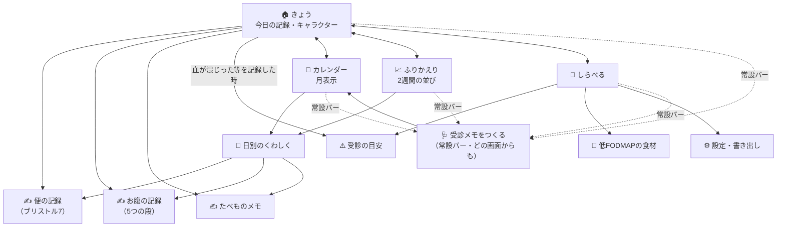

# 画面遷移とワイヤーフレーム（第1弾）

`MVP.md` で第1弾と決めた範囲だけの画面。**画面は7つ**、下部ナビは4つ。

---

## 1. 画面遷移図



**下部ナビは4つ**：`きょう／カレンダー／ふりかえり／しらべる`。
そのすぐ上に**常設バー「🩺 受診メモをつくる」**を置く（鍼灸アプリの合格ロードマップバーと同じ形）。
受診メモはこのアプリを持つ理由なので、思い立った時にどの画面からでも開けること。

**入口は3つだけ**にする（便・お腹・たべもの）。記録の入口が増えるほど、朝の1タップが遠くなります。

---

## 2. ワイヤーフレーム

モノクロ（黒地に白／白地に黒のどちらか一方に決める。企画では**白地に黒**を既定とし、
夜間の記録が多い想定で夜モードを別に持つ）。幅はスマホ1枚（横スクロールを作らない）。

### 2-1. きょう（ホーム）

```
┌────────────────────────────┐
│  腸                    ⚙️   │
├────────────────────────────┤
│                            │
│         ( ◠ ‿ ◠ )          │  ← 腸のキャラクター（SVG）
│      ～～～～～～～～        │     記録すると表情が変わる
│                            │     ※ 責める顔・泣く顔は持たない
│   きょうはどうですか？        │
│                            │
├────────────────────────────┤
│  お腹の調子                 │
│  ┌───┬───┬───┬───┬───┐   │  ← 5つの段。数字は出さない
│  │とて│ 楽 │ふつ│つら│とて│   │
│  │も楽│    │ う │ い │もつ│   │
│  └───┴───┴───┴───┴───┘   │
├────────────────────────────┤
│  お通じ            ＋ ふやす │
│  ┌──┬──┬──┬──┬──┬──┬──┐│  ← ブリストル1〜7（絵で選ぶ）
│  │ 1│ 2│ 3│ 4│ 5│ 6│ 7││     絵の下に短い言葉
│  └──┴──┴──┴──┴──┴──┴──┘│     （コロコロ／かたい／…／水）
│  きょう 2回                 │
│  □ 急に間に合わない感じ      │
│  □ 血が混じった             │  ← チェックすると
├────────────────────────────┤     「受診の目安」への行き先を出す
│  痛み  ○なし ○すこし ○ある  │     （判定はしない・色を変えない）
│  張り  ○なし ○すこし ○ある  │
├────────────────────────────┤
│  たべたもの            ＋   │
│  ・朝 ヨーグルト、パン       │
│  ・昼 —                    │
│  よく食べるもの: [ヨーグルト] │  ← 一度書いたものはタップで再入力
│                [うどん] …  │
├────────────────────────────┤
│  ✎ ひとこと（任意）          │
├────────────────────────────┤
│  記録した日 38日            │  ← 連続日数は出さない
│  この2週間 ▓▓░▓▓▓░▓▓▓▓░▓▓ │
├────────────────────────────┤
│   🩺 受診メモをつくる        │  ← 常設バー
├────────────────────────────┤
│  きょう  カレンダー  ふりかえり  しらべる │
└────────────────────────────┘
```

**朝ひとタップの意味**：お腹の段を1つ押した時点で、その日は「記録した日」になります。
残りは空でよい（空欄を赤くしない・催促しない）。

### 2-2. カレンダー

```
┌────────────────────────────┐
│  ‹  2026年9月  ›            │
├────────────────────────────┤
│  日 月 火 水 木 金 土        │
│      1  2  3  4  5  6       │
│     ▓  ▒  ░  ·  ▓  ▒       │  ← 濃さ＝お腹の段（5段）
│   7  8  9 10 11 12 13       │     記録が無い日は「·」
│   ·  ▓  ▓  ▒  ░  ·  ·      │     ※ 色を使わない
│  …                         │
├────────────────────────────┤
│  凡例 ▓つらい ▒ふつう ░楽    │
│       · 記録なし            │
├────────────────────────────┤
│  9月2日（水）               │
│  お腹：つらい                │
│  お通じ：ブリストル6 × 2回   │
│  たべたもの：ヨーグルト、パン │
│  ひとこと：会議の前から痛い   │
│  ［この日を書きかえる］       │
└────────────────────────────┘
```

### 2-3. ふりかえり（2週間の並び）

```
┌────────────────────────────┐
│  ふりかえり                 │
│  ［2週間］［1か月］［3か月］ │
├────────────────────────────┤
│  お腹の段                   │
│  つらい ┤    ●   ●●        │  ← 素のSVG。ライブラリを入れない
│  ふつう ┤ ●●  ●     ● ●    │
│    楽  ┤●        ●    ●●  │
│        └─────────────────  │
│         8/20        9/2     │
├────────────────────────────┤
│  お通じ（ブリストル）        │
│   7 ┤   ▪  ▪▪               │
│   4 ┤▪▪  ▪   ▪  ▪▪         │
│   1 ┤      ▪                │
├────────────────────────────┤
│  よく食べていたもの（14日）  │
│  ヨーグルト 9日 / パン 8日   │
│  たまねぎ 5日 / りんご 4日   │
│                            │
│  ※ 食べたものとお腹の調子を  │
│    並べています。どちらかが   │
│    どちらかの原因かは、この   │
│    表からは分かりません。     │
│    気になるものは、しばらく   │
│    やめてみて記録を続けると   │
│    自分の答えが出ます。       │
├────────────────────────────┤
│  この期間の記録日 11 / 14日  │
└────────────────────────────┘
```

**ここが第1弾でいちばん壊しやすいところ。** 「たまねぎ → 腹痛」と矢印で結んだ瞬間に、
このアプリは根拠のない食事指導になります。並べるだけにして、結ぶのは本人に任せる。

### 2-4. 受診メモをつくる

```
┌────────────────────────────┐
│  🩺 受診メモをつくる         │
├────────────────────────────┤
│  期間 ［直近2週間 ▾］        │
│  入れるもの                 │
│   ☑ お通じ（回数・かたさ）    │
│   ☑ お腹の調子              │
│   ☑ 気になる項目（血・急ぎ）  │
│   ☐ たべたもの              │
│   ☑ ひとこと                │
├────────────────────────────┤
│  できあがり（そのまま読める） │
│  ┌──────────────────────┐ │
│  │ 2026/8/20〜9/2（14日） │ │
│  │ 記録した日：11日        │ │
│  │ 排便：計21回（1日0〜3回）│ │
│  │  かたさ 6〜7：13回      │ │
│  │  かたさ 3〜5：6回       │ │
│  │  かたさ 1〜2：2回       │ │
│  │ 間に合わない感じ：5日   │ │
│  │ 血が混じった：0日       │ │
│  │ お腹がつらい：4日       │ │
│  │ 本人メモ：会議のある日に │ │
│  │  痛みが出ることが多い    │ │
│  └──────────────────────┘ │
│  ［コピー］［ファイルに書き出す］│
├────────────────────────────┤
│  ※ これは診断ではありません。 │
│    見せる相手は本人が選びます。│
└────────────────────────────┘
```

**文章は事実を並べた順に組み立てるだけ**（「IBSの疑い」等の解釈を書かない。鏡の
`toConsultText` と同じ線）。数え方は本人の記録だけから出す。

### 2-5. 受診の目安（レッドフラグ）

```
┌────────────────────────────┐
│  ⚠️ 受診の目安               │
├────────────────────────────┤
│  次のことがあるときは、       │
│  お腹の不調が続いているか     │
│  どうかに関わらず、           │
│  医療機関で相談してください。 │
│                            │
│  ・便に血が混じる            │
│  ・黒いタール状の便          │
│  ・体重が思いあたる理由なく減る│
│  ・夜中に目が覚めるほどの痛み │
│  ・熱が続く                 │
│  ・貧血を指摘された          │
│  ・50歳を過ぎてはじめて出た  │
│    お腹の症状                │
│  ・家族に大腸の病気の人がいる │
│                            │
│  当てはまる数は数えません。   │
│  当てはまらなくても、つらい   │
│  ときは受診してよいです。     │
│                            │
│  出典：（書名・発表者・年）   │
│  最終確認：2026-09-02        │
└────────────────────────────┘
```

**色を変えない・数えない・「緊急度」と書かない。** 一覧を読むだけの画面にします。

### 2-6. 低FODMAPの食材

```
┌────────────────────────────┐
│  🥣 低FODMAPの食材           │
│  ［さがす            🔍］    │
│  ［少なめ］［多め］［どちらも］│
├────────────────────────────┤
│  ごはん・パン・めん          │
│   ・白米          少なめ     │
│   ・小麦のパン    多め       │
│   ・そば（十割）  少なめ     │
│  やさい                     │
│   ・にんじん      少なめ     │
│   ・たまねぎ      多め       │
│  …                         │
├────────────────────────────┤
│  ※ 量によって変わります。     │
│    少なめの食材でも、たくさん │
│    食べれば合わないことが     │
│    あります。                │
│  ※ 一覧は改訂され続けています。│
│    出典：（発表者・年）       │
│    最終確認：2026-09-02      │
│  ※ 低FODMAPは自己流で長く    │
│    続ける食事ではありません。 │
│    続けるときは管理栄養士・   │
│    医師に相談してください。   │
└────────────────────────────┘
```

一覧に**自分のからだの結果**（合った／合わなかった）を1件ずつ付けられるようにします
（これが低FODMAPの本来の使い方＝一度減らして一つずつ戻す、に沿うため）。
ただし**合う／合わないを機械が判定しない**。押すのは本人。

---

## 3. データの持ち方

日付キー1本にそろえます（機能ごとに別のストアを作らない）。

```js
// chou:days の1件（key = date）
{
  date: '2026-09-02',       // YYYY-MM-DD（ローカル日付。toISOString() を使わない）
  belly: 'tsurai',          // 5つの段の id（数値にしない）
  pain: 'sukoshi',          // なし / すこし / ある / つよい
  gas:  'nashi',
  stools: [                 // 回数ぶん
    { at: '07:20', bristol: 6, urgent: true, blood: false }
  ],
  meals: [
    { at: '08:10', text: 'ヨーグルト、パン' }
  ],
  note: '会議の前から痛い',
  updatedAt: 1756...
}
```

守ること：

1. **保存するのは入力だけ。** 集計・判定の結果を保存しない（あとでロジックを直しても
   過去の記録を読み直せる。腰痛ナビのカルテ・鏡の見立てと同じ）。
2. **`belly` を数値で持たない。** 並べ替えが要る所では `BELLY_STEPS` の並び順を使う。
   数値で持つと、いつか平均を出したくなり、平均を出すと点数になります（決まり2）。
3. **`bristol` は 1〜7 の整数**（これは医療の物差しなので数値でよい）。**平均を出さない**
   ——1と7が1回ずつあった日の平均4は「ふつうの便が1回あった」ではありません。
   出すのは**分布**（1〜2が何回、3〜5が何回、6〜7が何回）。
4. **日付は文字列で組み立てる。** `new Date('YYYY-MM-DD')` も `toISOString()` も使わない
   （UTCで読まれて日本時間の午前0時が前日になる。Ouro 項目45・53と同じ）。
5. **消したものは戻せるようにする**（1件・20秒。鏡の `UNDO_MS` と同じ）。
6. **写真を持つなら別のストアへ**（`chou:photos`。日別の記録が写真で重くなると、
   書き出し・読み込みが一気に遅くなる）。書き出しに写真を含めるかは本人が選ぶ。

---

## 4. 実装の前提（作り始める人へ）

- **Vite + React（JSX・TypeScript なし・外部ランタイム依存なし）**、保存は IndexedDB。
  このリポジトリの他アプリと同じ構成。
- 公開パスは `/chou`。**`.github/workflows/deploy.yml` への追加が要る**
  （追加するまで URL は 404）。ルートの CLAUDE.md の同梱アプリ表にも1行足す。
- `src/lib/` は**ネットワークに触れない**（テストで機械チェックする）。
- **画像ファイルを持たない。** キャラクター・ブリストルの絵・お腹の図は、
  すべてその場に SVG を描く（Ouro の肖像・鏡の飾りと同じ）。
- **後読み（lookbehind）を使わない**（古い Safari で読み込みごと落ちる）。
- 目次・索引を作るときは、このリポジトリ共通のルール（読み必須・自動推定しない・
  数字は読みで振り分け・タイトル重複禁止）に従う。

### テストで機械チェックしたいこと（作る時に一緒に書く）

| 見るもの | なぜ |
|---|---|
| 画面に出す文字列に「診断」「◯◯症です」「緊急度」が無い | 決まり1 |
| `点` `スコア` を画面の文言に持たない | 決まり2 |
| 「1日◯g」「◯L」「◯％」の断定が無い | 決まり3 |
| `streak`／「連続」を返す関数が無い | 決まり5 |
| `src/lib/` に `fetch`／`XMLHttpRequest` が無い | 決まり8 |
| キャラクターの表情に「怒る」「泣く」「責める」が無い | 決まり9 |
| 出典データに `http` を含む文字列が無い | 決まり10 |
| 文言に「汚い」「恥ずかしい」「臭い」の類が無い | 決まり11 |
| `toISOString()`／`new Date('YYYY-MM-DD')` を日付の組み立てに使っていない | データ4 |
